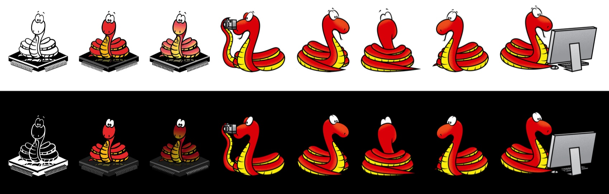

## The many forks & ports of MicroPython

The start of a community made list of MicroPython forks & ports, the goal of this is **not** to encourage forks, it's a list that has all the forks & ports, for what platforms, latest updates, and if they are open-source.

please do issue/PRs or email me to get edits here: pt@adafruit.com  

* * *

MicroPython  
https://micropython.org/  
https://github.com/micropython/micropython  
https://github.com/micropython/micropython/network <- sorta works, 100 most recently pushed forks.

MicroPython - micro:bit  
https://github.com/bbcmicrobit/micropython

MicroPython - openmv  
https://github.com/openmv/micropython

RockySong - OpenMV port to i.MX RT1050/1060  
https://github.com/RockySong/micropython-rocky

MicroPython - PyCom  
https://github.com/pycom/pycom-micropython-sigfox

MicroPython - Raspberry Pi, MicroPython on bare metal Raspberry Pi Zero / Zero W / 2  
https://github.com/boochow/micropython-raspberrypi

MicroPython - LEGO  
https://education.lego.com/en-us/support/mindstorms-ev3/python-for-ev3

MicroPython - Fomu  
https://github.com/xobs/micropython  

MicroPython - Xbee  
https://github.com/digidotcom/xbee-micropython

MicroPython - Micropython port for the Silcon Labs EFM32  
https://trmm.net/Ikea  
https://github.com/osresearch/micropython/tree/efm32/ports/efm32  

MicroPython - RT-Thread port with an excellent MicroPython IDE  
https://github.com/RT-Thread-packages/micropython  
https://marketplace.visualstudio.com/items?itemName=RT-Thread.rt-thread-micropython

MicroPython - Casio  
https://edu.casio.com/products/graphic/fxcg50/  
https://blog.adafruit.com/2018/12/06/python-snakes-its-way-to-the-casio-graphing-fx-cg50-prizm-calculator-casioeducate-casiojapan-micropython-micropython/

MicroPython - Numworks  
https://github.com/numworks/epsilon  
https://github.com/numworks/epsilon/tree/master/python/port

Pycopy  
https://github.com/pfalcon/pycopy  
http://www.pagema.net/micropython-fork-wars.html  
https://theiotmagazine.com/the-politics-of-dancing-with-micropython-9482dc2b4aaa  
https://www.blog.pythonlibrary.org/2020/02/10/pydev-of-the-week-paul-sokolovsky/

MicroPython - Microsemi, RISC-V (RV32 and RV64) architecture  
https://content.riscv.org/wp-content/uploads/2017/12/RISC-V-Poster-Preview.pdf

MaixPy - Sipeed  
https://github.com/sipeed/MaixPy

ArduPy - Seeed  
https://github.com/Seeed-Studio/ArduPy

ESP32 ones...  
  
loboris  
https://github.com/loboris/MicroPython_ESP32_psRAM_LoBo

CircuitPython  
https://circuitpython.org/  
https://github.com/adafruit/circuitpython  
https://circuitpython.readthedocs.io/en/4.x/README.html#differences-from-micropython

CircuitPython - TI (called TI-Python)  
https://blog.adafruit.com/2019/01/28/ti-planet-ti-python-import-sys-reveals-adafruit-circuitpython-on-ti-83-premium-ce-calculator-tiplanetnews-ticalculators-circuitpython-circuitpython/

CircuitPython - Gamebuino  
https://gamebuino.com/

* * *

Name, is it also called MicroPython?  
Date it was started and/or forked/ported?  
Where it is located, is the source code available?  
What chip(s)/platform(s) are supported?  
Who are the authors/maintainers?  
2-3 sentences of why the fork was made or link/overview.

* * *

Somewhat related, here is a "List of Linux distributions":  
https://en.wikipedia.org/wiki/List_of_Linux_distributions

