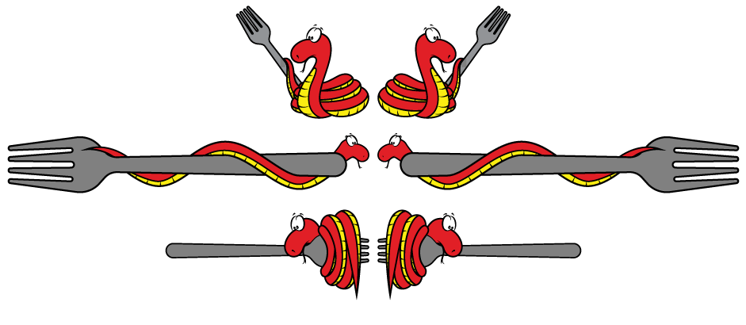
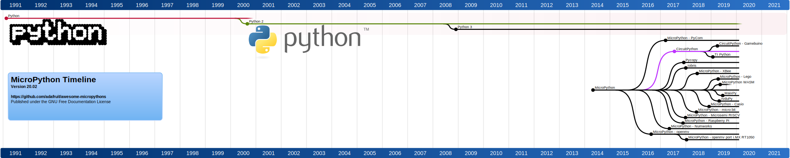

## The many forks & ports of MicroPython

The start of a community made list of MicroPython forks & ports, the goal of this is **not** to encourage forks, it's a list that has all the forks & ports, for what platforms, latest updates, and if they are open-source.

please do issue/PRs or email me to get edits here: pt@adafruit.com  

* * *

## MicroPython  
https://micropython.org/  
https://github.com/micropython/micropython  
https://github.com/micropython/micropython/network <- sorta works, 100 most recently pushed forks.

## MicroPython - micro:bit  
MicroPython for the micro:bit is an early port of MicroPython and is quite different to most ports due to the limited resources of the micro:bit (in particular the 16KB RAM of the Nordic nRF51822). The age of the fork and the tight resource constraints means that compromises have been made in the implementation of MicroPython for this platform so some API's are not as full-featured as on other ports.  
https://github.com/bbcmicrobit/micropython

## MicroPython - OpenMV  
The OpenMV project aims to create low-cost, Python-powered machine vision hardware. The OpenMV MicroPython fork stays close to mainline MicroPython but adds many computer vision algorithms, notably many from the OpenCV project. OpenMV is based on the powerful STM32 F7 and H7 microcontrollers.  
https://github.com/openmv/micropython

## RockySong - OpenMV port to i.MX RT1050/1060.  
A port of MicroPython to the i.MX RT family of micros. Presumably based on OpenMV rather than MicroPython to take advantage of the serious processing power that the RT10x0 range can provide for computer vision algortihms.  
https://github.com/RockySong/micropython-rocky

## MicroPython - PyCom  
PyCom have built a product line around the Espressif ESP32 and MicroPython. More recently they've also introduced cloud-based features to their product line to perform tasks such as remote firmware deployment. They've also integrated various radios include Sigfox, LoRa and cellular and each of them are packaged to be easily accessible from MicroPython. Uniquely amongst all other forks, PyCom have chosen to apply a different software license - GPL. A controversial decision in the MicroPython community since code written for PyCom cannot be shared upstream.  
https://github.com/pycom/pycom-micropython-sigfox

## MicroPython - Raspberry Pi, MicroPython on bare metal Raspberry Pi Zero / Zero W / 2  
https://github.com/boochow/micropython-raspberrypi

## MicroPython - LEGO  
https://education.lego.com/en-us/support/mindstorms-ev3/python-for-ev3

## MicroPython - Fomu  
The Fomu is a remarkable device that squeezes an FPGA into a device that can fit *inside* your USB port. This variant of MicroPython is designed to run on a RISC-V softcore running on the FPGA.  
https://github.com/xobs/micropython  

## MicroPython - Xbee  
https://github.com/digidotcom/xbee-micropython

## MicroPython - Micropython port for the Silcon Labs EFM32  
https://trmm.net/Ikea  
https://github.com/osresearch/micropython/tree/efm32/ports/efm32  

## MicroPython - RT-Thread port with an excellent MicroPython IDE  
https://github.com/RT-Thread-packages/micropython  
https://marketplace.visualstudio.com/items?itemName=RT-Thread.rt-thread-micropython

## MicroPython - Casio  
https://edu.casio.com/products/graphic/fxcg50/  
https://blog.adafruit.com/2018/12/06/python-snakes-its-way-to-the-casio-graphing-fx-cg50-prizm-calculator-casioeducate-casiojapan-micropython-micropython/

## MicroPython - Numworks  
https://github.com/numworks/epsilon  
https://github.com/numworks/epsilon/tree/master/python/port

## Pycopy  
https://github.com/pfalcon/pycopy  
http://www.pagema.net/micropython-fork-wars.html  
https://theiotmagazine.com/the-politics-of-dancing-with-micropython-9482dc2b4aaa  
https://www.blog.pythonlibrary.org/2020/02/10/pydev-of-the-week-paul-sokolovsky/

## MicroPython - Microsemi, RISC-V (RV32 and RV64) architecture  
https://content.riscv.org/wp-content/uploads/2017/12/RISC-V-Poster-Preview.pdf

## MaixPy - Sipeed  
The Kendryte K210 is an interesting RISC-V microcontroller; powerful, feature-rich and affordable. Sipeed make development boards that employ the K210 and they created and support a rich fork of MicroPython for their boards. Further, M5Stack also use the K210 for some development boards and Sipeed package MicroPython for these boards too.  
https://github.com/sipeed/MaixPy

## ArduPy - Seeed  
https://github.com/Seeed-Studio/ArduPy

## Loboris  
The "Lobo fork" was written by the prolific Boris Lovosevic and targetted only the Espressif ESP32 microcontroller. Originally forked to add PSRAM support to the mainline ESP32 port, Boris rapidly added many other desirable features including a powerful display module, SSH, Telnet and FTP integration, improved PWM and *much* more. Unfortunately it appears to be largely abandoned with no updates since 2018. Some of the features have been ported upstream to the mainline ESP32 port, an effort that continues.  
https://github.com/loboris/MicroPython_ESP32_psRAM_LoBo

## CircuitPython  
https://circuitpython.org/  
https://github.com/adafruit/circuitpython  
https://circuitpython.readthedocs.io/en/4.x/README.html#differences-from-micropython

## CircuitPython - TI (called TI-Python)  
https://blog.adafruit.com/2019/01/28/ti-planet-ti-python-import-sys-reveals-adafruit-circuitpython-on-ti-83-premium-ce-calculator-tiplanetnews-ticalculators-circuitpython-circuitpython/

## CircuitPython - Gamebuino  
https://gamebuino.com/

* * *

## Merged or Discontinued forks & ports

**MicroPython WASM** - For running MicroPython in a web browser. Merged into MicroPython
https://github.com/rafi16jan/micropython-wasm

* * *

Name, is it also called MicroPython?  
Date it was started and/or forked/ported?  
Where it is located, is the source code available?  
What chip(s)/platform(s) are supported?  
Who are the authors/maintainers?  
2-3 sentences of why the fork was made or link/overview.

* * *

Somewhat related, here is a "List of Linux distributions":  
https://en.wikipedia.org/wiki/List_of_Linux_distributions

